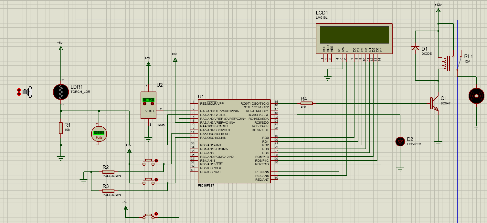
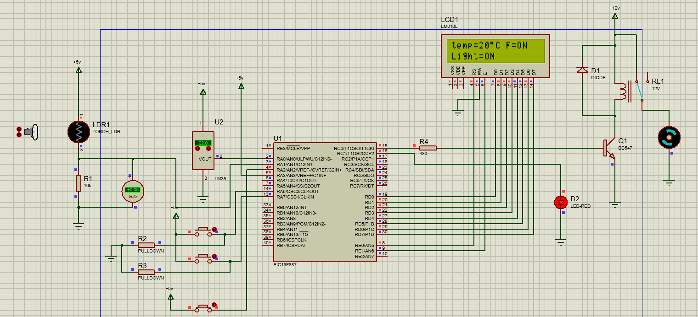

# Smart Room Automation System

## Overview

This project presents a smart room automation system designed using a PIC16F877A microcontroller. The system automates lighting and temperature control based on real-time environmental conditions and human presence, improving energy efficiency and user convenience.

## System Description

The system uses multiple sensors to monitor room conditions and control electrical appliances accordingly. The core idea is to activate the system only when a person is present and then make decisions based on light intensity and temperature.

## Working Principle

* A PIR sensor is used to detect human presence inside the room
* Once motion is detected, the system activates the LDR and LM35 sensors
* The LDR sensor measures the ambient light intensity
* The LM35 sensor measures the room temperature

### Lighting Control

* If the room is dark (low light intensity), the system automatically turns ON the light
* If sufficient light is present, the light remains OFF

### Temperature Control

The system operates in two modes:

#### 1. Default Mode

* A predefined temperature threshold is set
* If room temperature exceeds this value → Fan turns ON
* If temperature drops below threshold → Fan turns OFF

#### 2. Manual Mode

* User can adjust the temperature threshold
* Fan operation is controlled based on the user-defined value

## Display System

A 16x2 LCD display is used to show real-time system status, including:

* Temperature value
* Light condition
* System mode (Default / Manual)
* Device status (Light and Fan ON/OFF)

## Features

* Automatic room automation based on human presence
* Energy-efficient lighting control using LDR
* Temperature-based fan control using LM35
* Dual operating modes (Default and Manual)
* Real-time monitoring using 16x2 LCD display
* Reliable operation using PIC16F877A microcontroller

## Components Used

* PIC16F877A Microcontroller
* PIR Sensor
* LDR (Light Dependent Resistor)
* LM35 Temperature Sensor
* 16x2 LCD Display
* Relay / Output Devices (Light and Fan)

## Technologies Used

* Embedded C
* Sensor interfacing
* ADC (Analog to Digital Conversion)
* Microcontroller-based automation

## Applications

* Smart homes
* Energy-efficient buildings
* Automated lighting and temperature systems

## Conclusion

This project demonstrates an effective implementation of a smart room automation system using embedded systems. By combining multiple sensors and control logic, the system ensures efficient energy usage and improves user comfort through automation.

## Circuit Diagram

## Output

